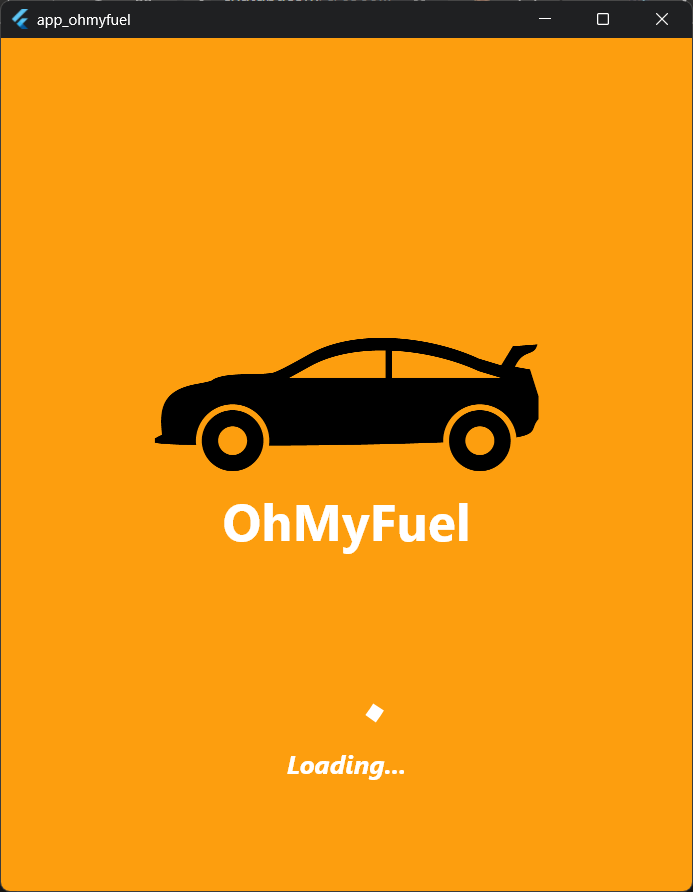
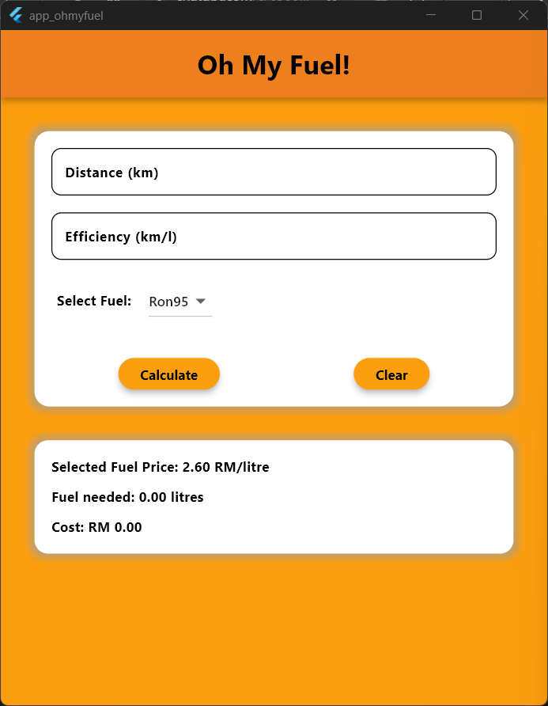
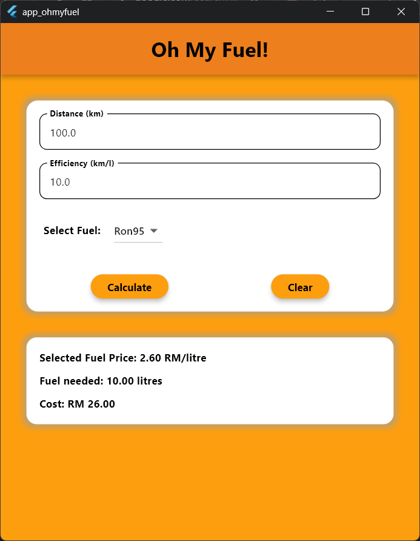

# app_ohmyfuel

### **Description**

OhMyFuel is a Flutter-based mobile application that allow users to input travel distance, car fuel efficiency inside textfields, and choose fuel type(RON95, RON97 and Diesel) from a dropdown button. The app will perform the calculation for the user and display the fuel needed to cover the travel distance based on the car fuel efficiency and also the fuel cost based on fuel needed and fuel price.

## Inputs -> Process -> Output

- **Inputs:**
  - distance(km), car fuel efficiency(km/litre), fuel type
- **Process**
  - formula used:
    - fuel needed = distance/ efficiency, efficiency>0
    - cost = fuel needed \* selected fuel price
- **Output**
  - user will see 3 things inside the output container:
    - selected fuel and its price(RM/litre)
    - fuel needed
    - cost

## Widgets Used

| Widget Name             | Purpose                                                                             |
| ----------------------- | ----------------------------------------------------------------------------------- |
| 'Text'                  | Displays labels, titles, error message, results                                     |
| 'TextField'             | Accept user inputs                                                                  |
| 'MyTextField'           | Custom TextField styling                                                            |
| 'DropdownButton'        | selection of fuel types                                                             |
| 'Elevated Button'       | calculate and clear button                                                          |
| 'Row/ Column'           | layout structure                                                                    |
| 'Container'             | decorate UI                                                                         |
| 'MediaQuery'            | get device height and width                                                         |
| 'SingleChildScrollView' | make app scrollable vertically                                                      |
| 'SafeArea'              | create a padding on top of app for notches, camera, etc. from device                |
| 'Visibility'            | show or hide widgets depending on a boolean condition statement                     |
| 'SizedBox'              | create small spacing between widgets and to set height and width or certain widgets |
| 'Stack'                 | stack widgets on top of one another                                                 |
| 'Image'                 | load local image from "assets" folder                                               |
| 'Positioned'            | to set position of stacked widgets                                                  |
| 'Navigator'             | navigate between pages/screens                                                      |

## Basic Validation Approach

- ensures only numeric values(0-9) are entered and cannot exceed a fixed length of digits using 'FilteringTextInputFormatter' with regex (r'^\d{1,5}\.?\d{0,3}')
- Check for missing values in textfields
- displays error text message 'Required Field' using **Visibility** and **Text**, with _visibility_ set to true
- check for 0 value for fuel efficiency
- prevents division by zero
- displays error text message 'Efficiency Cannot be Zero' using **Visibility** and **Text**, with _visibility_ set to true

## Authorship Note

**Name: Mohamad Ridhwan Bin Mohamad Amin Chong**
**Matric Number: 294737**

“I confirm that this project represents my own original work in accordance with academic integrity policies. No part of the code was fully generated by AI tools such as ChatGPT or GitHub Copilot. I relied solely on lecture notes, class tutorials, and official Flutter documentation. I understand that my work may be scrutinized, and if it is found that I did not personally develop the code, marks may be deducted, or the submission may be disqualified.”

## Screenshots

| Screen        | Description                                    | Image                                               |
| ------------- | ---------------------------------------------- | --------------------------------------------------- |
| Splash Screen | App opening screen with title and logo         |    |
| Home Before   | Home Screen before any input and output        |  |
| Home After    | Home Screen Result displayed after calculation |    |

## Link to GitHub Repository

https://github.com/RidhwanAC/app_ohmyfuel
